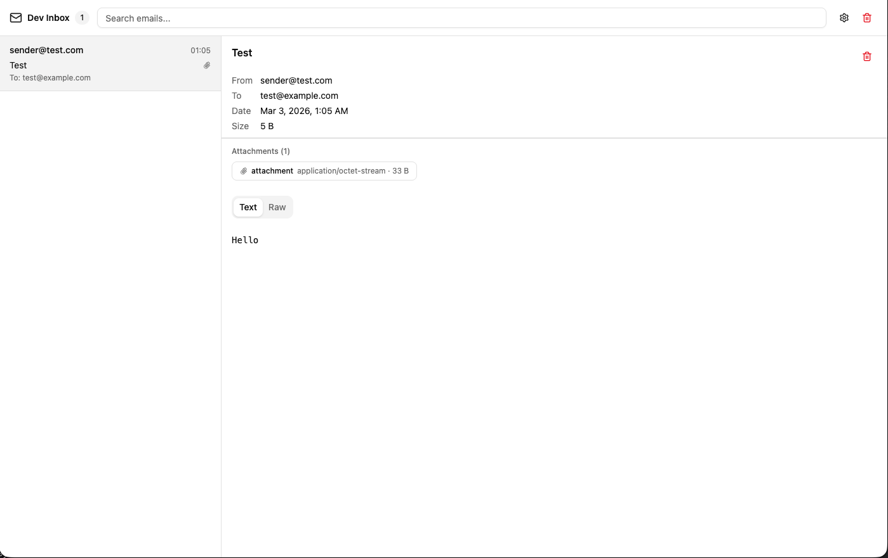

# dev-inbox

開発中のメール送信をキャプチャして確認するためのローカルメールテストツールです。

SMTPサーバーで受信したメールをリアルタイムでWebUIに表示します。

## スクリーンショット



## 機能

- **SMTPサーバー**: ローカルで起動するSMTPサーバー（デフォルト: ポート1025）でメールを受信
- **リアルタイム更新**: Server-Sent Events (SSE) によりメール受信を即時反映
- **メール閲覧**: テキスト/HTML本文、添付ファイルの表示と検索
- **メール管理**: 個別削除・一括削除
- **SMTP設定表示**: 接続先の設定情報を確認できるダイアログ

## スタック

| レイヤー | 技術 |
|---|---|
| フロントエンド | React 19 + TypeScript + Vite + Tailwind CSS |
| バックエンド | Node.js + Express 5 + TypeScript |
| SMTPサーバー | smtp-server + mailparser |
| パッケージ管理 | pnpm (モノレポ) |

## セットアップ

### 必要環境

- Node.js 20+
- pnpm 10+

### インストール

```bash
git clone https://github.com/your-username/dev-inbox.git
cd dev-inbox
pnpm install
```

### 環境変数

`.env.example` をコピーして設定します。

```bash
cp .env.example .env
```

```env
SMTP_PORT=1025
SMTP_HOST=0.0.0.0
API_PORT=3000
API_HOST=0.0.0.0
FRONTEND_URL=http://localhost:5173
```

## 使い方

### 起動

```bash
pnpm dev
```

- WebUI: http://localhost:5173
- API: http://localhost:3000
- SMTPサーバー: ポート1025

### アプリからメールを送信する

SMTPホストを `localhost`、ポートを `1025` に設定するだけで、送信したメールが自動的にdev-inboxに届きます。認証不要です。

**Node.js (Nodemailer) の例:**

```js
const transporter = nodemailer.createTransport({
  host: 'localhost',
  port: 1025,
  secure: false,
});
```

**Rails (Action Mailer) の例:**

```ruby
# config/environments/development.rb
config.action_mailer.delivery_method = :smtp
config.action_mailer.smtp_settings = {
  address: 'localhost',
  port: 1025,
}
```

## プロジェクト構成

```
dev-inbox/
├── apps/
│   ├── web/          # React フロントエンド
│   └── server/       # Express + SMTPサーバー
├── docs/
│   └── plan.md       # 開発計画・アーキテクチャ
├── .env.example
└── pnpm-workspace.yaml
```

## ライセンス

[LICENSE](LICENSE) を参照してください。
